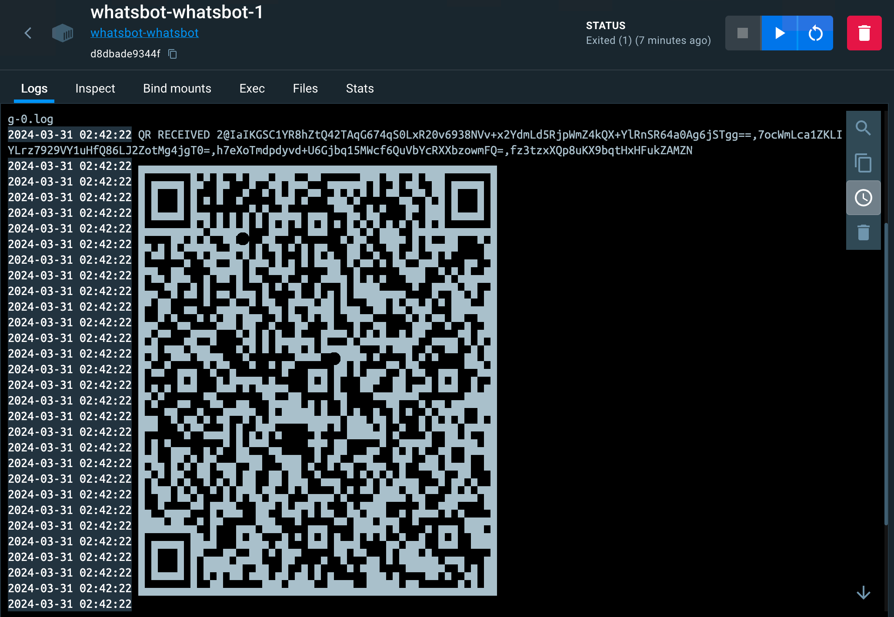

# Projeto WhatsBOT

Projeto de um BOT para WhatsApp usando a biblioteca `whatsapp-web.js`.



## Instalação

Ajuste o arquivo `.env` com as informações do número de telefone que receberá as mensagens de chamado do BOT.

Execute o comando abaixo para subir os containers:

```bash
docker compose up -d
```

## Uso

Abra o WhatsApp no seu celular e escaneie o QR Code apresentado no terminal do container.

# Autor: 

- Lucas Rodrigues Costa